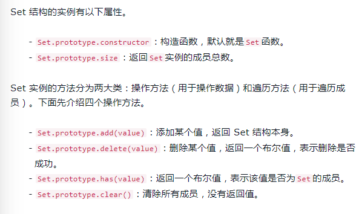

1. <a href="#h1"> 新类型 </a>
2. <a href="#h2"> 声明变量 </a>
3. <a href="#h3"> 解构赋值</a>
4. <a href="#h4"> 字符串</a>
5. <a href="#h5"> 正则 </a>
6. <a href="#h6"> 数字 </a>
7. <a href="#h7"> 数组 </a>
8. <a href="#h8"> 函数</a>
9. <a href="#h9"> 对象 </a>
10. <a href="#h10"> 数据结构 </a>
11. <a href="#h11"> Class </a>
100. <a href="#h100"> 历史</a>
<br/><a href="#ck"> 参考 </a>


<br/><br/><br/>

###  <h1 id="h1"> 1.新类型 </h1>
    Symbol()


<br/><br/><br/>

###  <h1 id="h2"> 2.声明变量 </h1>

- **let** 块级作用域，不存在变量提升（需先声明，后使用），且作用域“锁死”(在域里面不能先用在声明)
  
- **const**块级作用域，var函数作用域
  > const用于定义常量，引用类型不能改变值，但能改变值的属性和方法的添加
    ```
    var tem = '1'
    function k2() {
        tem = 'kkk';                
        console.log(tem)            // kkk
        var tem
    }
    k2()
    function k1() {
        tem = 'kkk';                //  Cannot access 'tem' before initialization
        console.log(tem)
        let tem
        // var tem
    }
    k1()
    ```


<br/><br/><br/>

###  <h1 id="h3"> 3.解构赋值 </h1>

- 字符串

    ```
    ① const [a,b,c,d,e] = 'hello';　　　　//b =》e
    ② let {length: len} = 'hello'　　　　  //len =》5
    ```

- 数组

    ```
    ① var [a, b, c] = [1, 2, 3]
    ② let [foo, [[bar,], baz]] = [1, [[2], 3]]
    ③ let [head, ...tail] = [1, 2, 3, 4]　　　　　　//...tail =》 2,3,4;        ...rest运算符;     类 对象扩展运算符 --arguments:  let a = [1,2,3]; let b = [...a];
    ④ let [a,b='kk'] = ['33']　　　　　　　　　　// b 的默认值是'kk'　
    ```

- 对象

    ```
      var foo; ({foo} = {foo:'bbb'})
    ① var {foo, bar} = {bar:'bbb', foo:'aaa'}
    ② let {foo:baz} = {foo:'aaa', bar:'bbb'}//  baz =》'aaa'    foo =》undefined
           (var {foo:foo, bar:bar} = {foo:'aaa', bar:'bbb'})
    ③ 重命名变量名： 
    let 后端数据 = {a:1, b:2}
    let {a:name, b:sex} =  
    后端数据;           console.log(name) =》 1 
    ```
    
- 函数

  ```
  function add([x, y]){　　return  x+y;　　}
  
  　　　　add([1,2])
  ```

  
<br/><br/><br/>

###  <h1 id="h4"> 4.字符串 </h1>

- 模板字符串(`${}`)

  ```
  let a ='你好'; 
  let b = `hello ${a} world 世界。`;    // hello 你好 world 世界
  ```


- 增(后两ES2017)
    
  + **repeat()**: 将字符串复制几遍
  ```
  字符串换成数字,负数或者Infinity会报错
  'r'.repeat(3) // 'rrr'
  'na'.repeat(0) // ''（值为0，NaN，'',0到-1之间的小数）
  ```
  + **padStart()**
  + **padEnd()**
  ```
  1. 用途
  '1'.padStart(10, '0') // "0000000001"
  '12'.padStart(10, 'YYYY-MM-DD') // "YYYY-MM-12"

  2. 第二个参数未传
  '1'.padStart(4) // '   1'

  3. 长度等于小于原来，返回原来
  'rinaa'.(9, '666') // 'rinna'
  ```


- 查
> 下面三个都返回布尔值; 第二个参数是从哪个键查起，endsWith为子字符串的长度
  + **includes()**     &nbsp;&nbsp;&nbsp;&nbsp;&nbsp;// search()
  + **startsWith()**   &nbsp;&nbsp;// indexOf()
  + **endsWith()**     &nbsp;&nbsp;&nbsp;&nbsp;// lastIndexOf()


- 清空
> ES2019 清空空格， tab 键、换行符等不可见的空白符号也有效，不改变原字符串
  + **trimStart()** &nbsp;// 别名 **trimLeft()** 
  + **trimEnd()**   &nbsp;&nbsp;// 别名 **trimRight()** 


- 查
> 键查值，超出undefined,支持负数
<br/>at(), 超出undefined,负索引
<br/>charAt(), 超出'',不支持负索引返''
  + **at()**

  ```
  const str = 'hello';

  str.at(1) // 'e'
  str.chartAt(1) // 'e'

  str.at(-3) // 'l'
  str.chartAt(-3) // ''

  ```

<br/><br/><br/>

- 转码
  + **String.fromCodePoint()**

  > Unicode编码转字符串
  ```
  String.fromCodePoint('0x20BB7') // 𠮷

  String.fromCharCode(0x20BB7) // 这个满足不了大于0xFFF
  ```

  + **codePointAt()**
  > 字符串转Unicode编码，满足4个字节存储的，如'𠮷'
  ```
  '𠮷'.codePointAt() // 134071
  ```

- 改
  + **replaceAll()** ES2021替换满足的所有,传统的replace()只能替换一个，否则用正则
   ```
   let str = 'hello'
   str.replaceAll('l', '6') // he66o

   str.replace('b', '_') // he6lo
   str.replace(/b/g, '_') // he66o
   ```


- **String.raw()**
 > 斜杠前面再加一个斜杠

 ```
 模板字符串
 String.raw`Hi\n${2+3}!` // Hi\\n5!

 正常函数(交差配合)
 String.raw({ raw: ['foo', 'bar'] }, 1 + 2) // foo3bar
 String.raw({ raw: ['foo', 'bar', fn] }, 1 + 2, 9) // foo3bar9fn
 ```

- 未看
  + normalize()
  


<br/><br/><br/>

###  <h1 id="h5"> 5.正则 </h1>

- 修饰符

  u、y

- stickey属性

  是否有y修饰符

- flangs属性

  返回修饰符

- matchAll()


<br/><br/><br/>

###  <h1 id="h6"> 6.数字</h1>
- 进制表示法
> B表示二进制，O表示八进制，D表示十进制，H表示十六进制<br/>
二前缀：0b / 0B<br/>
八前缀：0o / 0O<br/>
可用Number方法转十进制； 非严格模式   0o11 === 011<br/>

- 数值分隔符(**_**2021)<br/>
  数值中间看加**_**增加可读性<br/>
  限制规则

  ```
  不能放在数值的最前面（leading）或最后面（trailing）。
  不能两个或两个以上的分隔符连在一起。
  小数点的前后不能有分隔符。
  科学计数法里面，表示指数的e或E前后不能有分隔符。
  字符串转成数值的函数，不支持数值分隔符Number()、parseInt()、parseFloat()
  ```

- **Number.isFinite()**、**Number.isNaN()**

  ```
  Number.isFinite(15) // true 有限
  Number.isNaN(NaN)、Number('true' / 0) // true 
  ```
  
  ```
  isFinite(25) // true
  isFinite("25") // true
  Number.isFinite(25) // true
  Number.isFinite("25") // false

  isNaN(NaN) // true
  isNaN("NaN") // true
  Number.isNaN(NaN) // true
  Number.isNaN("NaN") // false
  Number.isNaN(1) // false
  ```

- **Number.parseInt()**, **Number.parseFloat()**
  与全局方法一致

- **Number.isInteger()**用来判断一个数值是否为整数。  
> 整数和浮点数采用的是同样的储存方法，所以 25 和 25.0 被视为同一个值(Number.isInteger(25)==Number.isInteger(25.0))


<br/><br/>

- Number.EPSILON
> 极小的常量,可以用来设置“能够接受的误差范围”

- **Number.isSafeInteger()**
> 判断整数是否在安全值(Number.MIN_SAFE_INTEGER~Number.MAX_SAFE_INTEGER之间)


<br/><br/><br/>

###  <h1 id="h7"> 7.数组</h1>

- **...**     : <small>扩展运算符</small>

- **Array.from()**：<small>转为数组，不改变原来遍历; [详细](https://developer.mozilla.org/zh-CN/docs/Web/JavaScript/Reference/Global_Objects/Array/from)</small>
  ```
  字符串转数组:
  const Str = 'yes';
  Array.of(Str)  // ["y", "e", "s"]
  
  Set转数组:
  const set = new Set(['one', 'two', 'three', 'two']);
  Array.of(set) // ["one", "two", "three"]
  
  对象转数组(要有length,不然不能转)：
  let arrayLike = {
      '0': 'a',
      '1': 'b',
      '2': 'c',
      length: 3
  };
  Array.from(arrayLike) // ["a", "b", "c"]
  ```
  
- **Array.of()**：<small>数值转为数组，不改变原来遍历; [详细](https://developer.mozilla.org/en-US/docs/Web/JavaScript/Reference/Global_Objects/Array/of);   可以用于替换new Array()的问题</small>

  ```
  Array.of(1,2,3,4)  // [1,2,3,4]  数值转为数组
  '1,2,3,4'.split(',')  // [1,2,3,4]  字符串转为数组
  
  Array.of(3) // [3]
  Array(3)    // [,,,]
  ```
  
- **copyWithin()** <small>替换 ，**改变原数组**</small>

  ```
  copyWithin 替换，数组长度不变，改变原数组
  [1,2,3,4,5].copyWithin(0, 3) // [4, 5, 3, 4, 5]
  
  splice 添加，数组长度改变，改变原数组
  [1,2,3,4,5].splice(0, 0, '外来数据1') // ['外来数据1', 1, 2, 3, 4, 5]
  ```
- **find() / findIndex()**  <small>返回值/键，undefind/-1</small>

  > findIndex()参数是函数
  >
  > indexOf()参数是字符串/数字

  ```
  const Arr =[1,2,3,4,5,6,7,8,9];
  let value1 = Arr.find(function(value,index,arr){
      return value > 5;
  })
  console.log(value1) // 6(返回值，没有返回undefind)
  let value1 = Arr.findIndex(function(value,index,arr){
      return value > 5;
  })
  console.log(value1) // 5(返回键，没有返回-1)  
  ```

<br/><br/><br/>

- **fill()** <small>填充，改变原数组</small>

  ```
  let arr=[0,1,2,3,4,5,6,7,8,9];
  arr.fill('Hi',2,5);              // 填充内容  start  end
  console.log(arr);                // [0,1,"Hi","Hi","Hi",5,6,7,8,9]
  ```

- **keys()/values()/entries()** <small>填充，改变原数组</small>

````
let arr = ['a', 'b', 'c'];
for (let key of arr.keys()) {  console.log(key);  }
> 0
> 1
> 2
for (let val of arr.values()) {  console.log(val);  }
> a
> b
> c
for (let item of arr.entries()) {  console.log(item)  }
> [0,"a"]
> [1,"b"]
> [2,"c"]
````
> 不借助for...of,可以用**next**
```
let arr = ['a', 'b', 'c'];
let list= arr.entries();
console.log(list.next().value);  // [0,"a"]
console.log(list.next().value);  // [0,"a"]
console.log(list.next().value);  // [0,"a"]

let keyList = arr.keys();
console.log(keyList.next().value);  // 0
```

- **inculdes()**

> 参1：查询的值 （NaN为true）<br/>
参2：从哪里开始查（默认，0开始/大于数组是也是0）<br/>
ES7， 返回布尔值<br/>
而indexOf()，返回是键<br/>

```
const Arr = [1,2,3, NaN];
Arr.includes(2)  // true
Arr.includes(NaN) // true（用indexOf(NaN)则是-1）
Arr.inculdes(3,5) // false(从键第5位开始查)
```

- **flat()，flatMap()**
> 多维数组减成低纬度或一位数组
 + **flat()** <small>参数数组</small>

 ```
 [1, 2, [3, 4]].flat() // [1, 2, 3, 4] (默认减一层，需要多少层次就写几)

 [1, [2, [3]]].flat(Infinity)  // [1, 2, 3](一律降成一维，用Infinity)

 [1, 2, , 4, 5].flat()  // [1, 2, 4, 5]（原数组有空位会跳过不返回）
 ```

 + **flatMap()** <small>参数回调</small>

 ```
 [1, 2, [3, 4]].map(item => item * 2) // [2, 4, NaN]（只处理一维，）
 ```

- **in**（对象和数组是否存在）

  ```
  obj = { a: 'blogs'}
  console.log('a' in obj);   // true    
  arr = [ 'blogs', '博客园']
  console.log(0 in arr);  // true         
  ```

<br/><br/><br/>


- **at()**（支持负索引）
> 超出返回undefined<br/>支持字符串和类数组
  ```
  const arr = [1, 2, 4, 8, 16];

  arr[-2] // undefined
  arr.at(-2) // 8

  const str = 'hello Tony!'
  str.at(-2) // y
  ```

- **空位** 返回undefined


<br/><br/><br/>

- forEach、filter、some、map(替换)、
> 返回item,index,arr
 ```
 forEach 不改变元数组
 filter 函数支持return，过滤满足条件的新数组 fArr = [1,2,3].filter(item=>{return item>2}) ->  [3]
 some
 map    函数支持return，处理的新数组 fArr = [1,2,3].filter(item=>{return item*2}) -> [2, 4, 6]
 ```


- toString();

- arr.map(function (arrItem) { /**/ })　　循环数组


<br/><br/><br/>

###  <h1 id="h8"> 8.函数 </h1>

- 参数默认值<small>(ES6之前参数不能指定默认值)</small>

  ```
  function Man( sex = '男', ) {
    this.sex = sex;
  }
  const m = new Man();
  m // { sex: '男' }
  ```

  参数限制：不能在声明、不能同名<br/>
  好处： 不用做判空处理，方便阅读<br/>

- ...
  
  + 代表后面所有参数，并且后面values不能在有参数，可替换arguments使用

  ```
  function add(a, ...values) {
    console.log(values)
  }

  add('参数1', '参数2', '参数3', '参数4') // '参数2', '参数3', '参数4'
  ```

  + 函数的length属性，不包括 rest 参数

  ```
  (function(a) {}).length  // 1
  (function(...a) {}).length  // 0
  ```
 
- 严格模式
> ES5之前函数内可设置模式，但ES2016函数参数使用了默认值、解构赋值、或者扩展运算符会报错（先执行函数后执行函数体）<br/>解决方法全局严格模式或用一个立即执行函数套[详见](https://es6.ruanyifeng.com/#docs/function#%E4%B8%A5%E6%A0%BC%E6%A8%A1%E5%BC%8F)

- name

  + ES6name

  ```
  function foo() {}
  foo.name // "foo"
  ```

  + 匿名函数

  ```
  const foo = function () {}

  ES5
  foo.name // ""

  ES6
  foo.name // "foo"
  ```

  + [其他情况](https://es6.ruanyifeng.com/#docs/function#name-%E5%B1%9E%E6%80%A7)

- 箭头函数

  ```
  var a = 0;
  let obj1 = {
      a: 1,
      fn1: function () {
          setTimeout(function () {
              console.log('普通函数')
              console.log(this.a)                    // 指向调用的对象
          },1000)
      }
  }
  let obj2 = {
      a: 2,
      fn2: function () {
          setTimeout( () => {
              console.log('箭头函数')
              console.log(this.a)                    // 指向所处的对象
          },1000)
      }
  }
  obj1.fn1()
  obj2.fn2()
  ```



- catch
> ES2019可省略catch参数
  ```
  ES5
  try {
    // ...
  } catch (err) {
    // 处理错误
  }

  ES2019
  try {
    // ...
  } catch {
    // ...
  }
  ```


### <h1 id="h9"> 9.对象 </h1>

- 属性的简洁表示法
> 属性名就是变量名, 属性值就是变量值<br/>不能用于构造函数

  ```
  var name = 'name', function = 'function';
  var obj = {name,function}
  ```

 + 结构

  ```
  var foo = ‘bar’　
  var baz = {foo}　
  
  => es5
  
  var baz = {foo:'baz'}
  ```

 + function结构  

  ```
  var o = {　　　 
    method () {}　
  }
  
  => es5
  
  var o = {
      method:function(){}
  } 
  ```

 + 对象的属性

  ```
  obj['a' + 'bc'] = 123;
  
  => es5
  
  let obj = {
    [prokey] : true,
    ['a' + 'bc'] : 123;　　　　　
  };
  ```

 + 报错

  ```
  const obj = {
    f() {
      this.foo = 'bar';
    }
  };

  new obj.f() // 报错
  ```

<br/><br/>

- 属性名表达式

  ```
  // 方法一: 直接用标识符作为属性名
  obj.foo = true;

  // 方法二: 用表达式作为属性名
  obj['f' + '00'] = false;
  ```

- name: 返回对象名称


- assign

  ```
  合并
  ```
- for...of
- 模块
  ```
  { cid as c, aid as a, family as f}
  export default   vs  export  import
  ```


<br/><br/><br/>

- **Object.is()**：
  ```
    Object.is(NaN,NaN); // true 
    Object.is(+0,-0); // false
  ```

- **Object.assign()**：
  ```
    const target = { a: 1 };
    Object.assign(target, {b: 2})
    target  // {a: 1, b: 2}        // 改变目标target, 不想改变{...target, b: 2}
   
  其他情况
  - 参数只有一个直接返回
  const obj = {a: 1};
  Object.assign(obj) === obj // true 

  - undefined和null
  Object.assign(undefined) // 报错
  Object.assign(null) // 报错 

  - undefined和null被跳过
  let obj = {a: 1};
  Object.assign(obj, undefined) === obj // true
  Object.assign(obj, null) === obj // true
  ```


<br/><br/><br/>

### <h1 id="h9"> 数据结构 </h1>

**new Map()** :map为解决对象中的键值不能为非数字,map((当前元素值,小标,当前数组)=>{})

**new Set()**

  ```
var m = new Map()
m.set('Adam', 67)
  ```


<br/><br/><br/>

### <h1 id="h11"> 11.Class </h1>
[22.class](./html/class1.html)<br/>
[23.继承](./html/class2.html)<br/>
class => new
1. 属性: 
  - constructor
  - 必须有一个constructor方法，没有则隐性添加
2. 方法: 
  + 方法与方法之间不需要逗号分隔,会报错
  + 类内部定义的方法不可枚举, 可用hasOwnProperty()
  ```
    //定义类
    class Point {

      constructor(x, y) {
        this.x = x;
        this.y = y;
      }

      toString() {
        return '(' + this.x + ', ' + this.y + ')';
      }

    }

    var point = new Point(2, 3);

    point.toString() // (2, 3)

    point.hasOwnProperty('x') // true
    point.hasOwnProperty('y') // true
    point.hasOwnProperty('toString') // false
    point.__proto__.hasOwnProperty('toString') // true
  ```
3. 变量不提升，与继承有影响
4. name ``class Point{}  Point.name // 'Point'``
5. Generator方法，在方法前加``*``
6. 静态方法，不能被实例继承(只能在类内部调用)，可被子类继承，在方法前加``static``, this指向类


<br/><br/><br/>

### <h1 id="h100"> 历史 </h1>

- ES8(ES2017)  [new **`Uint8Array()`**](https://developer.mozilla.org/zh-CN/docs/Web/JavaScript/Reference/Global_Objects/Uint8Array)

- **babal**

  ```
  npm install -g babel-cli (全局)
  npm install --save-dev babel-preset-es2015 babel-cli（生产环境）
  ```

- promize 

  https://www.jianshu.com/p/7e60fc1be1b2
- ??
  ```
  1.?? 的意思是，如果 ?? 左边的值是 null 或者 undefined，那么就返回右边的值。 
  let a = 99;,b=null;
  console.log(b??a)   =>   99       =>
  ```

- bug1

  ```
  bug1:Invalid attempt to destructure non-iterable instance
  let [name,id] = {name: 'tony', id: 1};    // 左右两边类型不同
  ```
- 生成器函数
  >（步骤生成器） function*    --   yield    --     next().value
  
  > yield 有return效果，但next()就走下一个next
  ```
  function* step(i) {
  　　yield i;
  　　console.log('下一步')
  　　yield i*3;
  } 
  
  let k = step(10)
  
  console.log(k.next().value)       // 10 
  
  console.log(k.next().value)       // 下一步  30
  ```


###  <h1 id="ck"> 参考 </h1>

[ES6文档](https://es6.ruanyifeng.com/#docs/promise)


- 过完ES6的22.class、23.class.1-3(2.28 - 3.1)
<br/>（差4-6）
- 过完ES6的5.字符串: 5-8、11(3-2)
- 过完ES6的5.字符串: 1、3、9、10(3-3)
- 过完ES6的9.数组: 1-8(3-3)
- 过完ES6的8.函数: 1、2、4、9(3-11)
- 过完ES6的5.字符串: 2(3-14)（差4）
- 过完ES6的9.数组: 10、11(3.16)
<br/>（差12）
- 过完ES6的10.对象1-3  / 过完ES6的11.对象: 1、2(3.1)
<br/>10(4-7) / 11（差3-6）
- 过完ES6的8.函数: 3(3-21)
<br/>（差5-8）
- 过完ES6的7.数值: 1-5(4-6)
<br/>（差6-9）


- 4、6、7、10
- 11-20
- 21、24-28

<br/><br/>
https://www.cnblogs.com/lgyong/p/8711550.html

[E6 ~ E10](https://www.cnblogs.com/miaSlady/p/10955729.html)

[ES2021](https://h3manth.com/ES2021/)

#### (ES2022)[https://h3manth.com/ES2020/]
1. top-level await（不在需要与async配合，可以单独）
2. 类
3. Temporal(完善Date(), 提前体验包：@js-temporal/polyfill)
4. 内置对象

 - Object.hasOwn()
 - at()
 - cause
 - /d