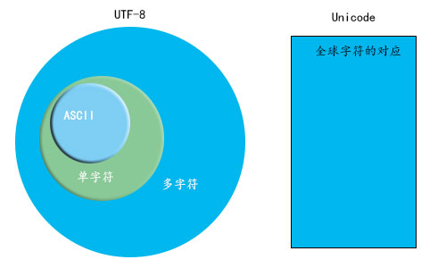

1. <a href="#h1"> 计算机码 </a>
2. <a href="#h2"> 进制转化 </a>
3. <a href="#h3"> 单位 </a>

###  <h1 id="h1"> 计算机码 </h1>
> 计算机内部，所有信息最终都是一个二进制值
 二进制位（bit）有0和1两种状态
 八个二进制位就可以组合出256种状态，这被称为一个字节（byte）
 - ASCII码 (美国a-z、A-Z等整合成128符号的对应表，A=65=01000001)
 
 - Unicode（万国码，因为ASCII码 只能满足美国的；其他国家也各自定自己的表不统一，像中文汉字几万个的;）
 > 一般用十六进制表示，0x 是 十六进制的前缀

 - UTF-8（Unicode的实现方式，正常是8位存储，可扩展到8位以上）

   
###  <h1 id="h2"> 计算机码 </h1>
 - **toString()** 十进制转16进制，参数2-36``25105.toString(16) // 6211``

 - **parseInt(其他进制数字,其他进制)** 其他进制转十进制,第二个参2-36``parseInt('F', 16) // ``

   
[字符编码笔记：ASCII，Unicode 和 UTF-8](http://www.ruanyifeng.com/blog/2007/10/ascii_unicode_and_utf-8.html)
[彻底弄懂 Unicode 编码](https://www.jianshu.com/p/9c9073e601d7)

   
###  <h1 id="h3"> 单位 </h1>
bit（比特，位，计算机最小单位）

1B（byte，字节，B）= 8 bit（见下文）

1KB（Kibibyte，千字节）=1024B= 2^10 B

1MB（Mebibyte，兆字节，百万字节，简称“兆”）=1024KB= 2^20 B

1GB（Gigabyte，吉字节，十亿字节，又称“千兆”）=1024MB= 2^30 B

