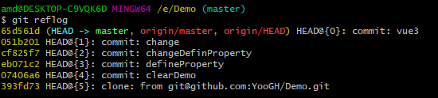
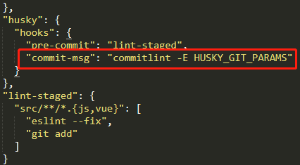
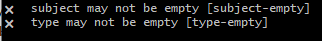

1. <a href="#h1"> 基本流程 </a>
2. <a href="#h2"> 账号设置 </a>
3. <a href="#h3"> 分支 </a>
4. <a href="#h4"> 合并/删除 </a>
5. <a href="#h5"> 回滚与补救 </a>
5. <a href="#h6"> 重命名 </a>
6. <a href="#h7"> 其他 </a>
7. <a href="#h8"> git 提交规范 </a>
8. <a href="#h9"> 可视化 </a>
<br/><a href="#ck"> 参考 </a>

<br/><br/><br/>

[git安装](https://www.git-scm.com/download/win)


<br/><br/><br/>

### <h1 id="h1"> 1. 基本流程 </h1>
  ```
  1 git clone '' // 克隆项目下来   （git clone -b 分支名称 git地址）
  2 cd 项目目录名
  3 git add . // 添加本地修改(git reset HEAD)
  4 git commit -m 'addAll' // git commit -m '注释'  缓存区内容添加到本地仓库(git reset --soft HEAD^)
  5 git pull // 拉去线上代码同步下
  6 git push -u origin master
  ```

git reset --mixed HEAD^(撤销commit，并且撤销git add . 操作)


<br/><br/><br/>

### <h1 id="h2"> 2. 账号设置 </h1>

- 暂时账号
  <br/>不更新全局就去掉``--global``

  ```
  git config --global user.name '你的用户名'githubo
  git config --global user.email '你的邮箱'
  ```

- 永久账号(生成ssh公钥, 设置公钥 在提交的时候不用每次都输入)

  ```
  1 ssh-keygen -t rsa -C "git上的邮箱" (生成 sshkey, ssh-keygen -t rsa -C "你的邮箱")
  2 三次回车即可生成 ssh key
  3 C:/Users/Administrator/.ssh下会看到 id_rsa 和 id_rsa.pub 两个文件，其中id_rsa是私钥，不可泄露出去，而id_rsa.pub是公钥，可以公开。
  4 找到 id_rsa.pub 文件（使用记事本打开）
  5. 复制里面的内容
  6. 粘贴到 https://gitee.com/profile/sshkeys 下的公钥文本框里面/ git:  点头像 -> settings -> SSH keys and GPG keys，标题随便写。
  ```

- git密码和用户名输错可以用
  
  ```
  git config --system --unset credential.helper
  ```


<br/><br/><br/>

### <h1 id="h3"> 3. 分支 </h1>

- 查看分支

  ```
  git branch 　　　　查看分支根
  git branch -a　　　查看所有分支
  git branch -r　　　查看远程分支
  ```

- 创建分支
> 相同点： git branch和git checkout -b都可以用于新建分支（默认基于当前分支结点创建）。
<br/>不同点： git branch新建分支后并不会切换到新分支； git checkout -b新建分支后会自动切换到新分支。

  ```
  git checkout -b 分支名(创建并切换)
  git branch 分支名(切换分支，没有就创建，但不切到当前分支)
  ```

- 切分支（保证当前分支提交后切分支） 

  ```
  git checkout　　　　　　　　　　　　查看更改内容文件
  git checkout 分支名　　　　　　　　   切换分支　
  ```


<br/><br/><br/>

### <h1 id="h4"> 4. 合并/删除 </h1>
- merge合并分支
  ```
  git  checkout master（切换别合并的分支，pull后再切到当前分支做merge合并操作  --   合并是本地两个分支的合并，在push到线上的）
  git merge kk(要合并到当前的分支 -- 当前分支master) 
  ```
- remote删除分支
  ```
  git branch -d 分支名称 (删除本地分支)
  git branch -D 分支名称（如果删除不了可以强制删除）
  git push origin --delete 分支名称（有必要的情况下，删除远程分支(慎用)）
  ```


<br/><br/><br/>

### <h1 id="h5"> 5. 回滚与补救 </h1>

  ```
  git reflog   (查看之前提交的)
  想回滚到2序列号(cf825f7)又要最后一次5(序列号393fd73)提交的修改（不要3-4的修改）
  git reset --hard cf825f7(回滚的序列号)
  git cherry-pick 393fd73
  ```




<br/><br/><br/>

### <h1 id="h6"> 6. 重命名 </h1>

  ```
  git branch -m 旧分支名 新分支名
  git push origin 新分支名
  删除旧分支
  ```


<br/><br/><br/>


### <h1 id="h7"> 7. 其他 </h1>
- **npm prefix -g**    全局安装路径
- **npm list -g**    全局安装路径和安装过的包
- **git status**    查看【提示消息中告诉我们哪些文件被修改】
- **git diff**    查看详细【查看详细修改内容#再修改文件,在文件中写点东西】

- git log    查看修改记录【打印出具体日志信息】 会显示版本号id对应的信息
- git log --pretty=online    我们也可以以一种更简洁的方式查看日志，只需要加上“--pretty=online”参数即可
- git reset --版本号    版本回退
- git reflog    记录我们每次执行的命令“git reflog”
- git checkout --text.txt    撤销修改
- git rm text.txt    删除文件

- git pull 和 git clone的区别
pull是更新 (首次git pull git@github.com:YooGH/min.git)
clone是下载（克隆 git clone 远程git仓库地址 如：git clone https://gitee.com/githubo/shandian.git）
clone某个分支： git clone -b 分支名 远程git仓库地址


<br/><br/><br/>

### <h1 id="h8"> 8. git 提交规范 </h1>

- feat：新功能/需求（feature）

- fix：修补bug

- docs：文档（document）

- style： 格式（不影响代码运行的变动）

- refactor： 重构（不是新增功能，也不是修改bug的代码变动，如重构代码设计等，）

- test：增加测试（如单元测试等）

- chore：构建过程或辅助工具的变动（如脚本文件，配置文件等）

- perf: 性能优化

- improvement: 改进

[参考](https://blog.csdn.net/github_39506988/article/details/90298780)


<br/><br/><br/>

### <h1 id="h9"> 9. 可视化 </h1>
- Sourcetree


- 提交限制
 + pageage.json-> husky.hooks.commit-msg

  

 + 如果提交格式不对报错（格式feat: kk）

  

 + sourcetree System.ComponentModel.win32exception : 重新安装git

<br/><br/><br/>

### <h1 id="ck"> 参考 </h1>
[源](https://www.cnblogs.com/lgyong/p/11577904.html)
  
[Git branch && Git checkout常见用法](https://www.cnblogs.com/qianqiannian/p/6011404.html)
  
[设置用户名和邮箱](https://www.cnblogs.com/donfaquir/p/10902623.html)

[Windows下Git入门教程)(http://blog.csdn.net/huangyabin001/article/details/35557231)
  
[git简易指南网址](https://www.bootcss.com/p/git-guide/)


<br/><br/><br/>
### git和svn的区别
1. Git是分布式的，而Svn不是分布的.
相同的是：Git跟Svn一样有自己的集中式版本库和Server端。
不同的是：但Git更倾向于分布式开发，因为每一个开发人员的电脑上都有一个本地仓库,所以即使没有网络也一样可以Commit，查看历史版本记录，创建项 目分支等操作，等网络再次连接上Push到Server端。

2. 版本库:
SVN只能有一个指定中央版本库。当这个中央版本库有问题时，所有工作成员都一起瘫痪直到版本库维修完毕或者新的版本库设立完成。
Git可以有无限个版本库。每一个Git都是一个版本库，区别是它们是否拥有活跃目录（Git Working Tree）。如果主要版本库（例如：置於GitHub的版本库）发生了什麼事，工作成员仍然可以在自己的本地版本库（local repository）提交，等待主要版本库恢复即可。工作成员也可以提交到其他的版本库

3. Git的内容的完整性要优于SVN

4. Git把内容按元数据方式存储，而SVN是按文件.
因为,.git目录是处于你的机器上的一个克隆版的版本库，它拥有中心版本库上所有的东西，例如标签，分支，版本记录等。.git目录的体积大小跟.svn比较，你会发现它们差距很大。

5. Git没有一个全局版本号，而SVN有

6. Git下载下来后，在离线状态下可以看到所有的Log,SVN不可以

7. 分支（Branch）
在SVN，分支是一个完整的目录。且这个目录拥有完整的实际文件。如果工作成员想要开啟新的分支，那将会影响“全世界”.
在git,每个工作成员可以任意在自己的本地版本库开啟无限个分支。举例：当我想尝试破坏自己的程序（安检测试），并且想保留这些被修改的文件供日后使用， 我可以开一个分支，做我喜欢的事。完全不需担心妨碍其他工作成员。只要我不合并及提交到主要版本库，没有一个工作成员会被影响。等到我不需要这个分支时， 我只要把它从我的本地版本库删除即可

8. 提交（Commit）在SVN，当你提交你的完成品时，它将直接记录到中央版本库。当你发现你的完成品存在严重问题时，你已经无法阻止事情的发生了。如果网路中断，你根本没办法提交！而Git的提交完全属於本地版本库的活动。而你只需“推”（git push）到主要版本库即可。Git的“推”其实是在执行“同步”（Sync）。


1 git init

2 git remote add origin 远程git仓库地址(在线上新建的目录下克隆https，将线下线上连接,如：git remote add origin ...git) 

3 git pull --rebase origin master（线上的项目有README.md,需要下载在本地才能执行下面操作）

4 git add .（添加本地修改）

5 git commit -m 'addAll'  （git commit -m ‘注释’ 将缓存区内容添加到本地仓库）

6 git push -u origin master （操作2、3和6都是线上操作；将本地版本库推送到远程服务器， origin是远程主机，master表示是远程服务器上的master分支，分支名是可以修改的）

(快速发布  git add . && git commit -m '订单配送-搜索' && git push )rmder支持中文