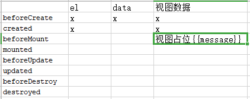
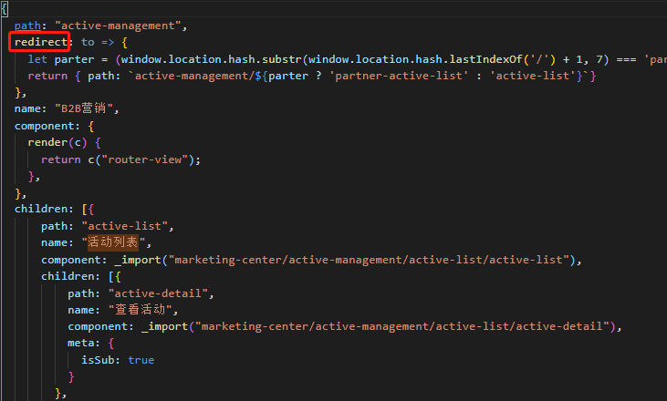

  > 1. <a href="#h1"> 生命周期 </a>
  > 2. <a href="#h2"> 路由 </a>
  > 3. <a href="#h3">  </a>
  >    <a href="#ck"> 参考 </a>

  <br/><br/><br/><br/>

  ###  <h1 id="h1"> 1.生命周期 </h1>

  > **created**：逻辑和视图没没绑定thie.el为空(**可以掉接口和this赋值**，beforeCreated调报错this.data和this.el为初始化this没有指向)<br/>
  >
  > **beforeMount**：逻辑和视图绑定了，但是虚拟dom,视图占位，``<div>msg</div>``**msg**没解析<br/>
  > 挂载，数据，视图（created:可以访问数据但还不能更新，因为没挂载，beforeMount: 视图占位）<br/>
  >
  > [文件](./life.html)

  

  


  <br/><br/><br/><br/>

  ###  <h1 id="h2"> 2.路由 </h1>

  https://www.imooc.com/article/78706

  + hast

   - window.onhashchange
   - #结尾
     <br/>```http://localhost:8080/pages/shop/messages/messagesDetailo#/pages/shortVideo/person-info/person-info?personId=244573```

  + history

   - 修改页面路径，直接请求后端，没有会404
   - pushState()、replaceState()
     <br/>```http://localhost:8080/pages/shop/messages/messagesDetail```

  ```
  路由参考
  [Vue-cli3如何添加路由（router）](https://blog.csdn.net/dengzy926/article/details/86521579)
  https://www.jb51.cc/vue/31476.html
  https://www.cnblogs.com/calvin-dong/p/11222150.html
  http://shanhuxueyuan.com/news/detail/137.html
  ```

  

  + 开发遇到问题<br/>
  [同路由不同参数无法通过this.$query获取](https://segmentfault.com/q/1010000009329520) => ``wacth: {'$route'(to, from){console.log(to, from)}}``<br/>
  [vue 监听$route的方式](https://blog.csdn.net/m0_38073829/article/details/79072195)<br/>


  <br/><br/><br/><br/>

  ###  <h1 id="ck"> 参考 </h1>
  vue2中完全兼容IE10以上,部分兼容IE9及以上(核心的object.defineProperty ie8及以下不支持，Promise也是)

  ```
  this.$data.msg = this.msg
  this.$nextTick(()=>{this.方法名();})
  this.$store.commit('chat/Notification_Clear_All', null, {root: true} )
  watch
  ```

  [如何简短精干的描述vue生命周期](https://www.jianshu.com/p/a165474f620e)

  [Vue核心知识-Vue的生命周期方法](https://www.jianshu.com/p/ca50f0651fe0)

  [手摸手带你理解Vue响应式原理](https://mp.weixin.qq.com/s?__biz=MzI4OTY2MzE0OA==&mid=2247486683&idx=1&sn=2171032be7b0ad58e957bdf22aaf70b9&chksm=ec2afd18db5d740e4fab45f2af60a88d61a03e614f35066a28d5a85cf73d7ecf61a1c38318df&mpshare=1&scene=1&srcid=&sharer_sharetime=1593480923272&sharer_shareid=7c051bef8d1eeee00a3c6ff9c1514600&key=7fa4c9207b4feb1fd45e105b2e33a6a8f8dd9029a5453f8f6b53455d9bb4d4f39e5dfd1f8e521ebf42a84deaf6e45b43ce967ede6f34e6994054ef29bb0afffb3937464f7d3d739377f37b9272f4381d&ascene=1&uin=MzExOTA2NzkyNg%3D%3D&devicetype=Windows+10+x64&version=62090523&lang=zh_CN&exportkey=AwF%2BpcLZXB4JqRBh4wUHPCg%3D&pass_ticket=eu4%2B9AfWrv6A1J6FRRkkaRm3YWQy5kJFhT4YFzpN9NsMmLd86tDzyMrOQzooM2B1)

  发布订阅者：https://zhuanlan.zhihu.com/p/51357583、https://www.cnblogs.com/itgezhu/p/10947405.html

  []()

  在简单项目中，使用  v-cloak 指令是解决屏幕闪动的好方法。但在大型、工程化的项目中（webpack、vue-router）只有一个空的 div 元素，元素中的内容是通过路由挂载来实现的，这时我们就不需要用到 v-cloak 指令咯。

  https://www.jianshu.com/p/f56cde007210

  [Vue-cli3如何添加路由（router）](https://blog.csdn.net/dengzy926/article/details/86521579)
