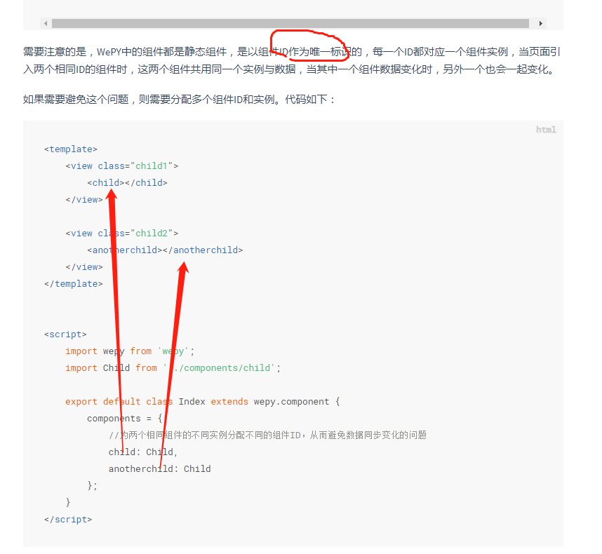

1. <a href="#h1"> 小程序关闭自己 </a>
2. <a href="#h2"> 小程序跳转公众号 </a>
3. <a href="#h3"> 小程序跳转小程序 </a>
4. <a href="#h4"> 开发工具中不执行的函数 </a>
5. <a href="#h5"> 下来刷新api </a>
6. <a href="#h6"> WEPY框架 </a>
7. <a href="#h7"> 获取手机号 </a>
8. <a href="#h8"> 分包 </a>
9. <a href="#h9"> 更新 </a>
100. <a href="#h100"> 。。。 </a>


<br/><br/>
###  <h1 id="h1"> 1、小程序关闭自己 </h1>
> navigator组件，属性target为miniProgram，open-type为exit(exit退出，需targer="miniProgram"为前提)
```
<navigator target="miniProgram" open-type="exit"></navigator> 
```


<br/><br/>
###  <h1 id="h2"> 2、小程序跳转公众号 </h1>
> ①.[official-account](https://developers.weixin.qq.com/miniprogram/dev/component/official-account.html)
> ②.小程序和公众号同一主体（认证的公司或个人信息相同，可在设置->基本设置查看）
> ③.公众号要与小程序关联
> ④.小程序要开启“公众号关注组件”(设置->关注公众号)
```
<official-account></official-account>
```


<br/><br/>
###  <h1 id="h3"> 3、小程序跳转小程序 </h1>
> 跳转之前微信自带弹框，提示用户是否跳转
> [wx.navigateToMiniProgram](https://developers.weixin.qq.com/miniprogram/dev/api/navigate/wx.navigateToMiniProgram.html) 属性envVersion(develop 开发版 | trial 体验版 | release 正式版)
> 目标appid需要，全局app.json的navigateToMiniProgramAppIdList添加跳转小程序的appid
```
wx.navigateToMiniProgram({
  appId: '',  // 目标appId
  path: 'pages/index/index?id=123', // 跳转页面路劲( 参数在`App.onLaunch`、`App.onShow` 和 `Page.onLoad`能获取 )
  extraData: {},                    //            ( 参数在`App.onLaunch`，`App.onShow`能获取 )
  envVersion: 'develop', // 
  success(res) {
    // 打开成功
    console.log(res)    
  }
})
```
> **app.json**
```
"window": {
  "backgroundTextStyle": "light",
  "navigationBarBackgroundColor": "#fff",
},
"navigateToMiniProgramAppIdList": ["目标appId"],
```


<br/><br/>
###  <h1 id="h4"> 4、开发工具中不执行的函数 </h1>
> wx.getSystemInfo回调的res.brand判断
```
wx.getSystemInfo({
    success: function (res) { 　　　　　// 当设备为'devtools',则开发工具
        if (!(res.brand == 'devtools')) {
           console.log('不是开发执行')
        }
         
    }
})
```


<br/><br/>
###  <h1 id="h5"> 5、下来刷新api </h1>
```
uni.showNavigationBarLoading()
uni.stopPullDownRefresh();  （onPullDownRefresh() {}）
```


<br/><br/>
###  <h1 id="h6"> 6、WEPY框架 </h1>
- wpy文件中的script、template、style这三个标签都支持lang和src属性
-（config、components、data、methods、events、其他函数）
  ```
    import wepy from 'wepy';
    // 声明一个App小程序实例
    export default class MyAPP extends wepy.app {}
    // 声明一个Page页面实例
    export default class IndexPage extends wepy.page {}
    // 声明一个Component组件实例
    export default class MyComponent extends wepy.component {}
  ```
- this.$parent =》 getApp()
- WePY中的methods属性只能声明页面wxml标签的bind、catch事件，不能声明自定义方法，这与Vue中的用法是不一致的。
  


<br/><br/>
###  <h1 id="h7"> 7.获取手机号 </h1>
> button的open-type为``getPhoneNumber``, bindgetphonenumber方法获取数据

 - getPhoneNumber:ok
 -  getPhoneNumber:fail deny(ios和安卓空格不一样)<br/>

 ``
 e.detail.errMsg.includes('getPhoneNumber:fail') && e.detail.errMsg.includes('deny')
 ``

 - getPhoneNumber:fail cancel


  ```
   <button open-type="getPhoneNumber" bindgetphonenumber="getPhoneNumber" bindtap="showError">登录</button>
   
  
   getPhoneNumber(e) {
     switch(e.detail.errMsg) {
       case 'getPhoneNumber:ok':
         // 获取手机号成功(用户点击“确定”)
         break;
       case 'getPhoneNumber:fail deny':
         // 获取手机号失败(用户点击“拒绝”)
         break;
       case 'getPhoneNumber:fail cancel':
         // 获取手机号失败(用户双击了登录按钮,目前只有安卓机有这种情况)
         break;
     }
   }
  ```


<br/><br/>
###  <h1 id="h8"> 8.[分包](https://developers.weixin.qq.com/miniprogram/dev/framework/subpackages.html) </h1>

> 文件app.json加属性subpackages
 - 独立分包：不需要加载主包（独立模块，不与主包公共方法等）
 - 分包预加载：主包加载完，后加载分包（不用访问分包才加载，造成空白页）
    ```
      "preloadRule": {
        "pages/index/index": { // 进入这个页面开始加载如下分包
          "network": "all", // 不限网络（另一个值wifi）
          "packages": { "包名" }
        }
      }
    ```
  - 分包异步化: 子组件访问子组件
  ```
  require('../subPackageB/utils.js', utils => {
    console.log(utils.whoami) // Wechat MiniProgram
  })
  ```


<br/><br/>
###  <h1 id="h9"> 9.[微信小程序自动更新](https://blog.csdn.net/le_17_4_6/article/details/83036518) </h1>

<br/><br/>
###  <h1 id="h100"> 。。。 </h1>
 ```
  1.买域名
  2.域名备案，加白名单（线下）
  3.网上加白名单(线上)
  4.域名与ipA记录
   
   
   
  小程序跳公众号文章或公众号
  1.公众号邀请小程序关联(小程序appid)
  2.小程序最高管理者在手机上确认即可
   
   
   
   
   
  official-account
  1.设置的公众号需与小程序主体一致。
   
  2.限制
  当小程序从扫 二维码场/小程序码 景（场景值1011/场景值1047）打开时
  当小程序从聊天顶部场景（场景值1089）中的「最近使用」内打开时，若小程序之前未被销毁，则该组件保持上一次打开小程序时的状态
  当从其他小程序返回小程序（场景值1038）时，若小程序之前未被销毁，则该组件保持上一次打开小程序时的状态
   
  3.组件大小（最小宽度为300px，高度为定值84px。）
  4.
  公众号可关联
  同主体的10个小程序
  不同主体的3个小程序
  同一个小程序可关联最多500个公众号
 ```


