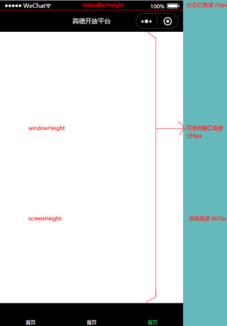
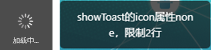

0. <a href="#h0"> 生命周期 </a>
1. <a href="#h1"> WXML </a>
2. <a href="#h2"> CSS </a>
3. <a href="#h3"> JS </a>
4. <a href="#h4"> 弹框（界面） </a>


[后端接口](https://developers.weixin.qq.com/miniprogram/dev/api-backend/)
[小程序自定义组件全局样式不生效的解决方法](https://www.jb51.net/article/218984.htm)

[mpvue](http://mpvue.com/)、
[wepy](https://tencent.github.io/wepy/document.html#/)


<br/><br/>
###  <h1 id="h0"> 0、生命周期 </h1>
#### HISTORY
  ```
  内测时间 2016年9月21日
  发布时间 2017年1月9日
  小游戏  2017年12月28日，微信更新的 6.6.1 版本开放了
  ```
#### 应用生命周期[>](https://developers.weixin.qq.com/miniprogram/dev/framework/app-service/app.html)
- onLaunch(options)   初始化（全局启动一次）
- onShow(options)
- onHide
- onError  脚本报错
- onPageNotFound 找不到页面
①.onshow(从二级页面回来加载)，onread、onready(从二级页面回来不加载)  (第一次进入页面：onload、onshow、onready)
②.onHide() 页面隐藏/切入后台时触发。
> 官方：如 navigateTo 或底部 tab 切换到其他页面，小程序切入后台等。
> 测试：点小程序右上角胶囊按钮的圆圈，退出小程序；navigateTo,switchTab
③.onUnload()页面卸载时触发。
> 官方：如redirectTo或navigateBack到其他页面时。
> 测试：官方自带的返回上层按钮。

<br/><br/>

#### 页面生命周期[>](https://developers.weixin.qq.com/miniprogram/dev/framework/app-service/page.html)
- onLoad (options)
- onShow
- onReady
- onHide
- onUnload

- onPullDownRefresh 刷新 (wx.showNavigationBarLoading() 、 wx.stopPullDownRefresh())
- onReachBottom 加载
- onPageScroll 滚动
- onAddToFavorites 右上角收藏
- onShareAppMessage 右上角分享
- onShareTimeline 右上角朋友圈
- onResize 尺寸变化
- onTabItemTap tab页面触发
- onSaveExitState 页面销毁前保留状态回调


<br/><br/>
###  <h1 id="h1"> 1、WXML </h1>
- **input：** 属性**bindinput**为小程序双向绑定（vue则为v-model）``bindinput="getInputValue"``
- **picker：** 自定义数组对象需两个属性配合（range和range-key）
- **scroll-view：** 请勿在中使用textarea、map、canvas、video组件
- **换行：** \n 在text组件中生效（如果在view里面要套个text）
<br/><br/><br/><br/>
- **movable-view**　　 iphone控制点
- **swiper**　　　　　 轮播图、商品详情的商品轮播
> **swiper**做轮播图时，真机给不了圆边（图片滚动会变直角）
  ```
  /* 在swiper套一层view: 受swiper里面有transform样式影响，要以transform治理transform */
  border-radius: 20rpx;
  overflow: hidden;
  transform: translateY(0);
  ```
- **scroll-view**　　  scroll
  ```
   左右滚动需要scroll-x="true"
   上下滚动需要给定高度
  ```
  ```
　　1.scroll-view 中的需要滑动的元素不可以用 float 浮动；
　　2.scroll-view 中的包裹需要滑动的元素的大盒子用 display:flex; 是没有作用的；
　　3.scroll-view 中的需要滑动的元素要用 dislay:inline-block; 进行元素的横向编排；
　　4.包裹 scroll-view 的大盒子有明确的宽和加上样式-->  overflow:hidden;white-space:nowrap;
  ```
- 解决微信小程序ios端滚动卡顿的问题
> 方法1：scroll-view组件且设置高度；方法2:overflow:auto; -webkit-overflow-scrolling: touch;
- textarea的placeholder-style在开发工具有时没效果，真机可以，所以文档支持开发工具没效果，可看真机

<br/><br/>
###  <h1 id="h2"> 2、CSS </h1>
- CSS元素组件的清默认效果
  ```
  button { margin: 0; padding: 0; line-height: normal; text-align: left; background: transparent; border-radius: 0; box-sizing: content-box; }
	button::after { border: 0; }
	input { min-height: 0; height: 0; }
	cover-view { line-height: 0/normal; overflow: visible; pointer-events; }
  ```
- 盒子:（w3c标准盒模型 -- 宽高等于宽高,  IE盒模型 -- 宽高等于宽高 + padding + border）, 小程序button默认是IE盒模型
- 超小屏幕 手机 (<768px)       |       小屏幕 平板 (≥768px)       |       中等屏幕 桌面显示器 (≥992px)       |       大屏幕 大桌面显示器 (≥1200px)
- iphone5/6/7　　顶部导航64px = 128rpx ( 开发微信小程序时设计师可以用 iPhone6 作为视觉稿的标准。width=750rpx)
  
- 小程序阻止遮罩层下的页面滚动
  ```
    弹出框根元素样式：position:fixed;top:0;left:0;width:100%;height:100%;overflow:hidden;
    弹出框根元素事件：catchtouchmove="空的事件" （catchtouchmove="nullEvent"     nullEvent (res) {}）
  ```

<br/>
- 原生组件覆盖问题
  ```
    ①、聚焦时，展示原生组件，不聚焦时，模仿原生组件写个view
    ②、覆盖时display:none; / position:absolute;left:-1000rpx; / v-if进行隐藏   (小程序地图tab情况用v-if，会出现多个未知地图,用position: absolute;)
    ③、input框可以用z-index的view覆盖（基础库2.8.1）
    ④、小程序图层兼容（input用cover-view或view替换；image圆边用view套一层）
  ```


<br/><br/>
###  <h1 id="h3"> 3、JS </h1>
- wx.navigateBack()当delta的值小于等于0时，都说放回上一层。(小程序基础库2.6.0)
- 减少setData:
  ```
    ①、canvas代替setData,
	  ②、数据不用展示时，不使用setData,用this.data.xx代
  ```
- catchtap防止冒泡
  ```
  currentTarget vs target
  父元素事件子元素也能触发
  e.currentTarget.dataset
  e.target.dataset 点击子元素是没有数据的
  ```
- "tabBar"页面，跳转的其他页面是不关闭本页面的(第二次进入tabBar页面时，只执行onshow);
- 官方自带返回上一层是关闭本页面的(再次进入本层时，又重新开始执行onload - onshow - onready);
<br/>
- globalData为内存。storage为缓存。即小程序退出globalData会清空，storage则不会。
  ```
    关闭微信 或退出小程序太久时(相当于删了小程序重新搜索，但不清除缓存)  ==  开发工具中的ctrl + s
    关闭微信 或退出小程序太久时：小程序的会被回收，之前只是隐藏的页面(onHide), onload会再次执行；
    关闭微信 或退出小程序太久时：data和globalData的值会初始化
  ```
- wx的运行环境
  ```
  IOS的webkit（苹果开源的浏览器内核）
	Android的X5（QQ浏览器内核）
	开发工具nw.js（C++实现的web转桌面应用）
	为什么wx不直接运行在浏览器（webview）中，而要绕过浏览器直接调用内核呢？因为运行在浏览器中的webapp是做不了监控的，而wx的表现是半native app，半web app,而native app与web app和一个很重要的区别就是native app 有自己的生命周期。
  ```
- 原生组件覆盖问题
  ```
    ①、聚焦时，展示原生组件，不聚焦时，模仿原生组件写个view
    ②、覆盖时display:none; / position:absolute;left:-1000rpx; / v-if进行隐藏   (小程序地图tab情况用v-if，会出现多个未知地图,用position: absolute;)
    ③、input框可以用z-index的view覆盖（基础库2.8.1）
    ④/小程序图层兼容（input用cover-view或view替换；image圆边用view套一层）
  ```
- 时间苹果new Date('2021/01/04 00:00:00'), 不能用 new Date('2021-01-04 00:00:00')
- 小程序要求服务器TLS必须大于等于 1.2，服务器低于TLS低于TLS 1.2  。控制台输入 showRequestInfo() 可以获取更详细信息。
  ```
    https://www.linuxidc.com/Linux/2017-04/142744.htm
    https://blog.csdn.net/ghlfllz/article/details/72832436
    https://blog.csdn.net/ruoshuiyx/article/details/80597503
    https://blog.csdn.net/kirawoo/article/details/78737242
  ```


<br/><br/>
###  <h1 id="h4"> 4、弹框 </h1>
> [界面-交互](https://developers.weixin.qq.com/miniprogram/dev/api/ui/interaction/wx.showToast.html)
1. 消息提示框(状态图加文字说明): showToast<br/>
  关闭： 属性duration自动关闭或者hideToast关闭<br/>
  长度： icon==none可以大于7字符，其他类型最多7字符
2. loading 提示框(转圈需手动关闭): showLoading<br/>
  关闭： 需要hideLoading才能关闭
**showLoading和showToast区别**<br/>

 ```
 showLoading需要手动关闭hideLoading关闭，showToast能自动关闭(duration)或手动关闭hideToast
 showLoading(加载图，title限制7个), showToast(状态图，title限制7个； none, title限制两行)
 ```

3. 模态对话框(确定和取消或x关闭): showModal<br/>
  关闭： 确定和取消或x关闭

4. 操作菜单: showActionSheet<br/>
  下弹框，选择

5. 开启小程序页面返回询问对话框: 


<br/><br/>
[blogs](https://www.cnblogs.com/lgyong/p/9959023.html)

[小程序工作原理浅析](https://www.cnblogs.com/SophiaLees/p/11409339.html)

